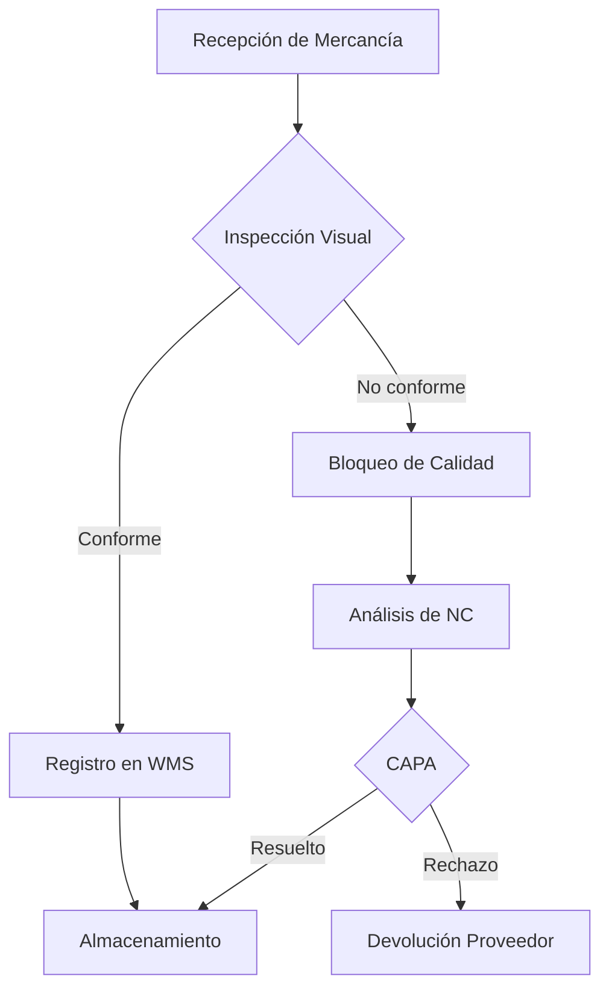
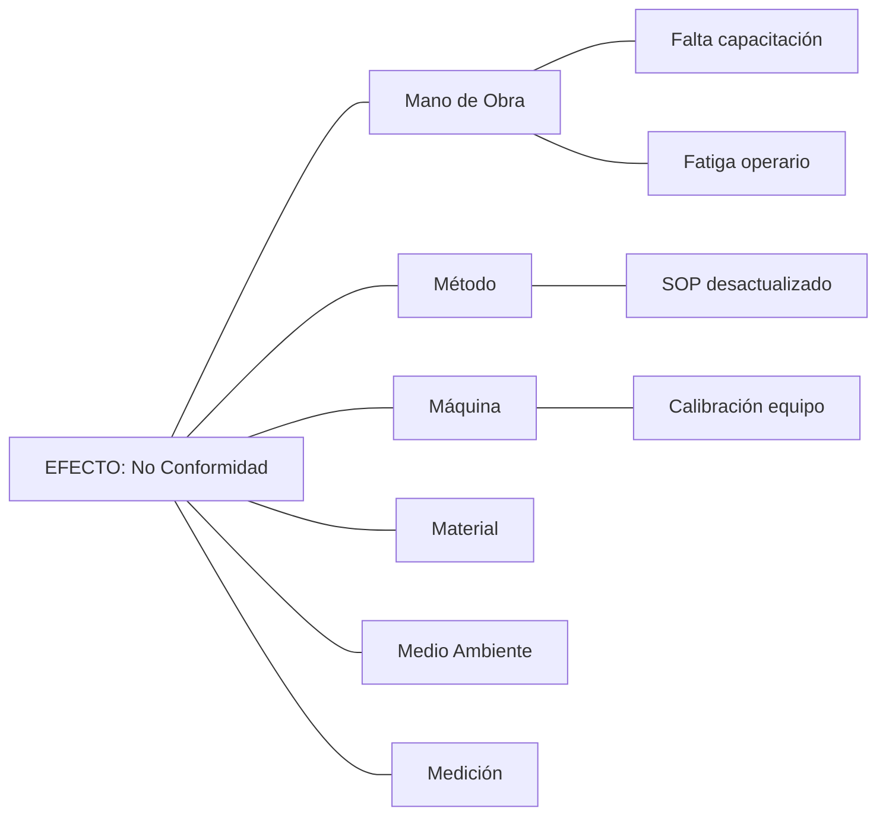
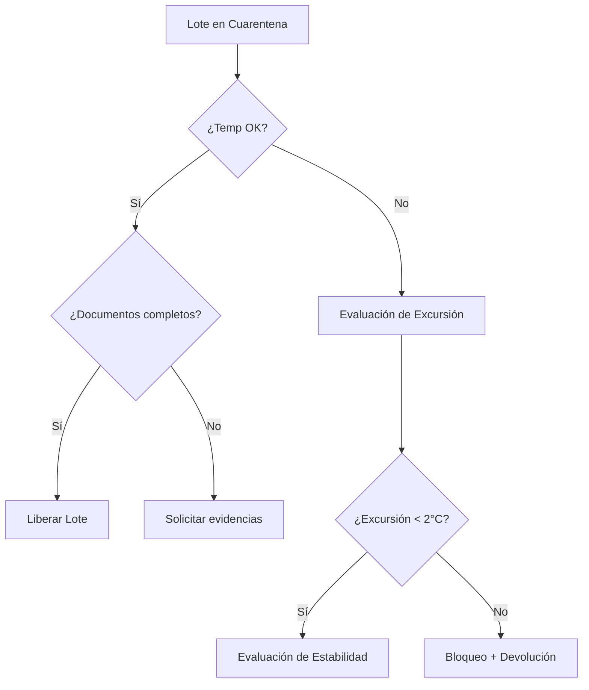

# Skill: Generador de Diagramas Mermaid

## Cuándo activar
Cuando el usuario pida un flujo, procedimiento, mapa de decisiones, flujograma, diagrama de causa-efecto o árbol de decisión.

## Instrucciones

Genera automáticamente código en sintaxis Mermaid.js para renderizar el diagrama solicitado.

### Tipos de diagramas

**Flujogramas BPMN** (procesos operativos):

**Diagramas de Causa-Efecto (Ishikawa)**:

**Árboles de Decisión** (liberación de lote, excursiones térmicas):

### Reglas
- Usa nodos con texto descriptivo en español.
- Incluye decisiones como rombos `{}` y procesos como rectángulos `[]`.
- Para Ishikawa, usa las 6M: Mano de Obra, Método, Máquina, Material, Medio Ambiente, Medición.
- Basa los flujos en los procedimientos vigentes de Integr@ recuperados.
- Cita el código del documento Integr@ que respalda cada paso del flujo.
